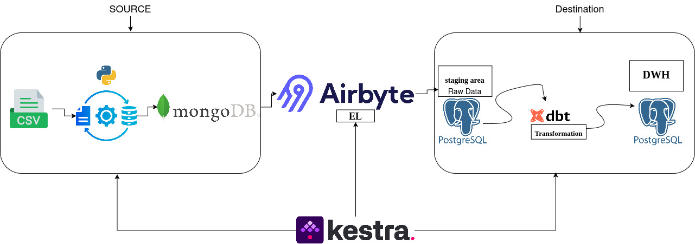
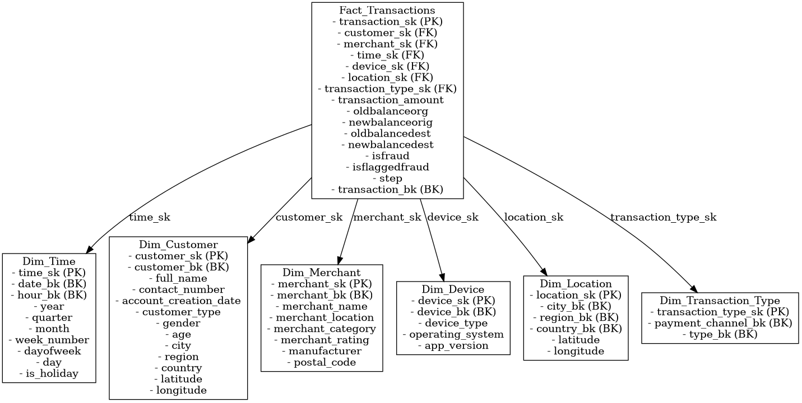
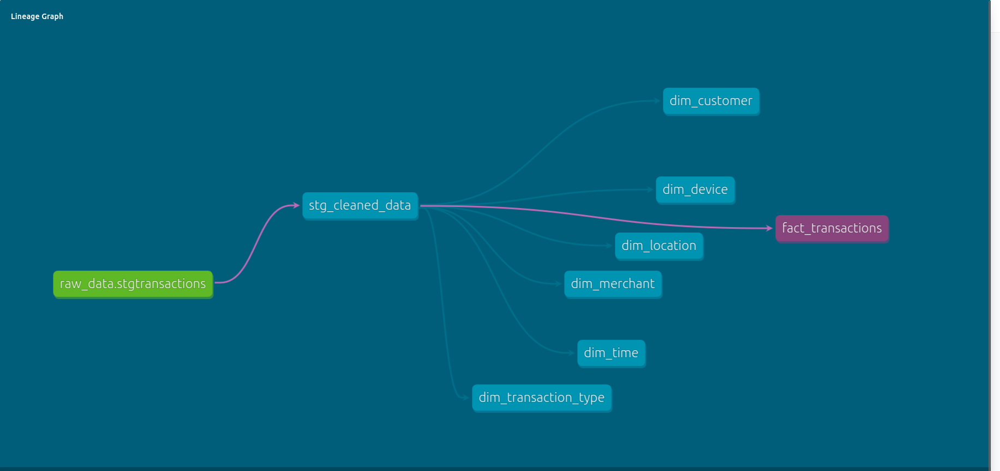

# Fraud Detection and Transaction Risk Analysis

## Overview
This project implements a **fraud detection and transaction risk analysis pipeline** for a digital wallet system. The pipeline extracts data from CSV, loads it into MongoDB, transfers it to PostgreSQL using Airbyte, transforms it with dbt, and orchestrates the workflow with Kestra.

## Data Pipeline Architecture
Below is the architecture of the ELT pipeline:



## Technologies Used
- **Python & Pandas**: For data processing and transformation.
- **MongoDB**: NoSQL database for storing raw transaction data.
- **Airbyte**: For extracting and loading data from MongoDB to PostgreSQL.
- **PostgreSQL**: Used as both the staging area and the Data Warehouse (DWH).
- **dbt**: For data modeling and transformation into a Star Schema.
- **Kestra**: For orchestrating and automating the ELT workflows.

## Data Flow
1. **CSV to JSON & MongoDB**
   - Read transaction data from a CSV file.
   - Convert the data into JSON format.
   - Insert the JSON data into MongoDB.
2. **MongoDB to PostgreSQL Staging**
   - Use Airbyte to extract data from MongoDB.
   - Load the extracted data into a staging table (`stg_cleaned_data`) in PostgreSQL.
3. **PostgreSQL to Data Warehouse**
   - Use dbt to transform the staged data into analytical models (Dimensions and Fact tables).
   - Store the transformed data in the PostgreSQL Data Warehouse under the schema `wallet_db_marts_DWH`.
4. **Orchestration with Kestra**
   - Automate and schedule the entire ELT workflow using Kestra.

## Data Model
The project follows a **Star Schema** design to enable efficient analytical queries. The schema consists of the following tables:


### Dimension Tables
- **Dim_Customer**: Contains information about wallet users who initiate transactions.
  - **Primary Key**: `customer_sk` (Surrogate Key).
  - **Attributes**: `customer_bk` (Business Key: `nameorig`), `full_name`, `contact_number`, `account_creation_date`, `customer_type`, `gender`, `age`, `city`, `region`, `country`.
- **Dim_Merchant**: Contains details of merchants receiving payments.
  - **Primary Key**: `merchant_sk` (Surrogate Key).
  - **Attributes**: `merchant_bk` (Business Key: `namedest`), `merchant_name`, `merchant_category`, `merchant_location`, `merchant_rating`.
- **Dim_Time**: Contains date and time-related attributes for transactions.
  - **Primary Key**: `time_sk` (Surrogate Key).
  - **Attributes**: `date_bk`, `hour_bk`, `year`, `quarter`, `month`, `day`, `dayofweek`.
- **Dim_Device**: Stores device details used in transactions.
  - **Primary Key**: `device_sk` (Surrogate Key).
  - **Attributes**: `device_bk` (Business Key: `device_id`), `device_type`, `manufacturer`, `operating_system`, `app_version`.
- **Dim_Location**: Stores geographic location data for transactions.
  - **Primary Key**: `location_sk` (Surrogate Key).
  - **Attributes**: `city_bk`, `region_bk`, `country_bk`, `latitude`, `longitude`, `postal_code`.
- **Dim_Transaction_Type**: Stores transaction type and payment channel information.
  - **Primary Key**: `transaction_type_sk` (Surrogate Key).
  - **Attributes**: `payment_channel_bk`, `type_bk`.

### Fact Table
- **Fact_Transactions**: Stores transaction details and links to all dimension tables.
  - **Primary Key**: `transaction_sk` (Surrogate Key).
  - **Foreign Keys**:
    - `customer_sk` → Links to `Dim_Customer`.
    - `merchant_sk` → Links to `Dim_Merchant`.
    - `time_sk` → Links to `Dim_Time`.
    - `device_sk` → Links to `Dim_Device`.
    - `location_sk` → Links to `Dim_Location`.
    - `transaction_type_sk` → Links to `Dim_Transaction_Type`.
  - **Attributes**: `transaction_amount`, `oldbalanceorg`, `newbalanceorig`, `oldbalancedest`, `newbalancedest`, `isFraud`, `isFlaggedFraud`, `step`, `transaction_bk` (Business Key: `transaction_id`).



#### Notes on the Data Model
- The schema ensures that each dimension table has a unique Surrogate Key, achieved by deduplicating records using `ROW_NUMBER()` in dbt.
- Fraud-related attributes (`isFraud`, `isFlaggedFraud`) are stored directly in the `Fact_Transactions` table for efficient querying.
- The `Dim_Transaction_Type` table combines `payment_channel` and `type` to reduce redundancy.

## Running the Pipeline
### Prerequisites
Ensure you have the following installed:
- Python (with Pandas, PyMongo, etc.)
- MongoDB
- PostgreSQL
- Airbyte
- dbt
- Kestra

### Steps
1. **Run the Python script to insert data into MongoDB:**
   ```bash
   python convert_to_json_connect_mongo.ipynb
